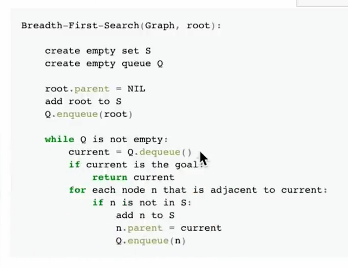

Breadth first search 
Finds shortest route between two nodes in a graph
   

Node

Value
Edges
Searched = True/False
Parent

Graph
Nodes

Graph

1.Get data
2.Create Nodes
3.Join edges and create graph

You can not have two instances of same Movie BUT
you can have two instances of same actor
